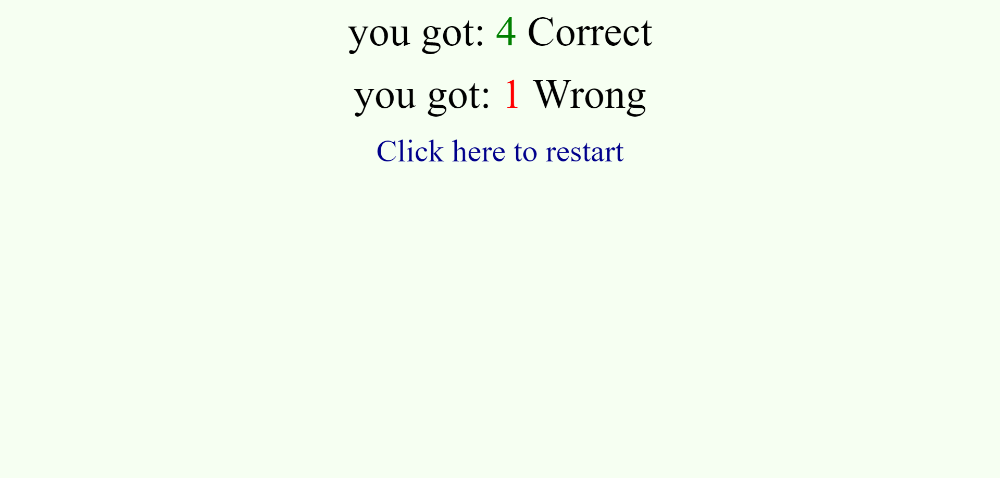

# Trivia Game

## Purpose

Proof of concept for multipl choice trivia game.

## Instructions

It will ask you five questions and you have 10 seconds to answer each question. at the end it tells you your score. The questions are randomly pulled from a list and the options will be in a random order.

## Images
This is what a question looks like

This is the score screen at the end

## Author

Evan Jones

## Technologies Used

Made using HTML, CSS, javascript, and Jquery.

## Contact

evanjones@fastmail.net
